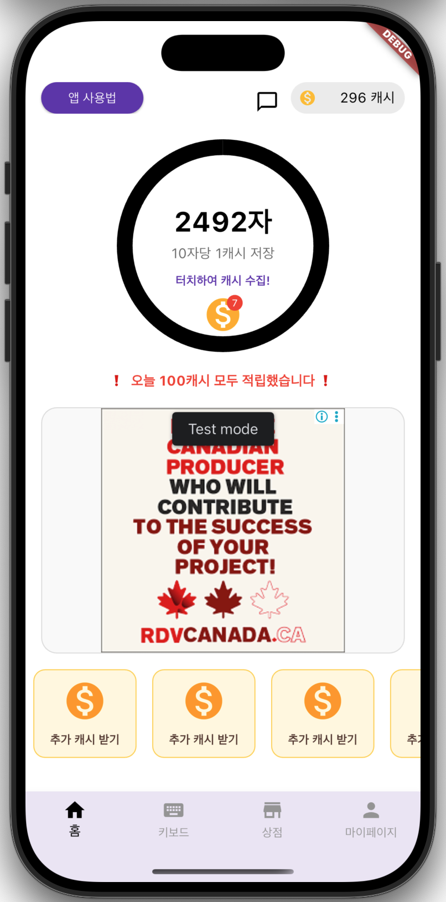
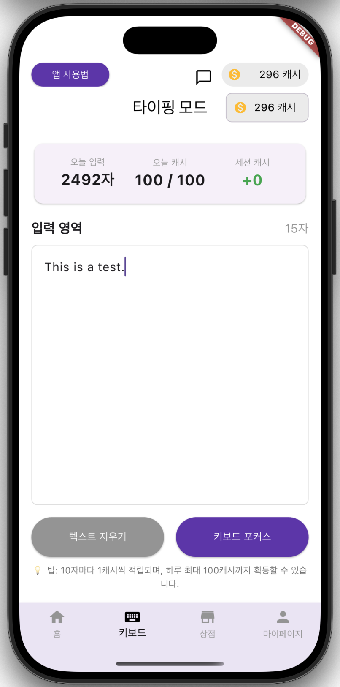
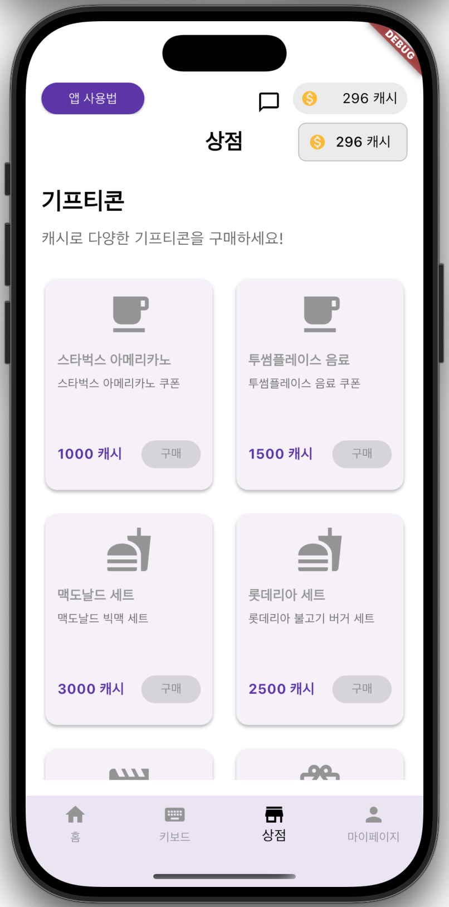
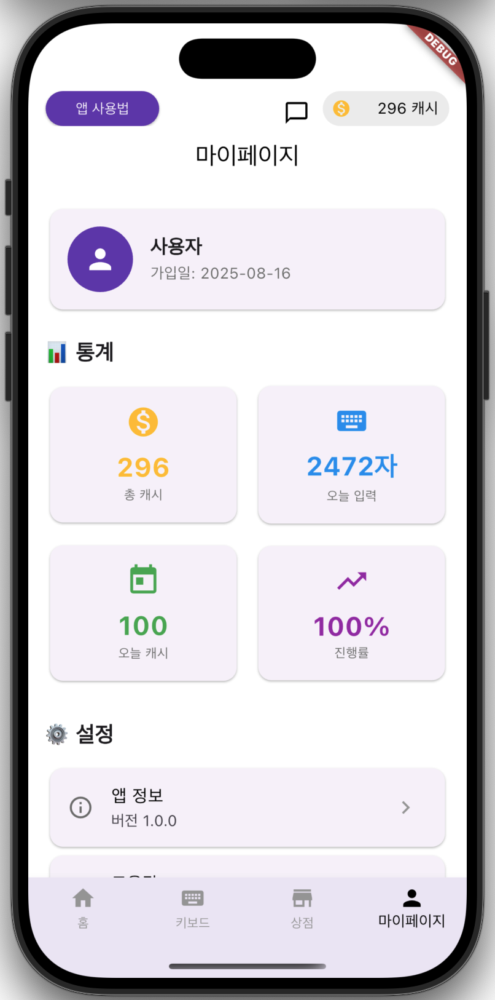

# AppTech – Reward-Based Typing App (Built with Flutter & Firebase)

AppTech is a reward-based mobile application where users can earn virtual cash by typing. Designed to promote consistent engagement, habit-building, and instant gratification, the app enables users to accumulate points through daily missions and redeem them for gift cards. It includes gamified UI, real-time progress tracking, and a plan for cloud-native architecture using AWS.

---

## 📸 Screens Overview

### 🏠 Home Screen: Real-time progress bar, daily goal indicator, bonus reward display


### ⌨️ Second(Event) Screen: *(Feature under planning – to be implemented in a future update)*


### 🛍️ Store Screen: Grid layout gifticon items, point balance, and purchase flow


### 🙍 Profile Screen: Total stats, session logs, settings, and logout option


---

## ✨ Key Features

* **🎯 Typing-to-Earn System**: Earn 1 point per 10 characters typed (up to 100 points per day)
* **📊 Visual Progress Tracker**: Circular progress bar shows daily goal completion
* **🛙 Gifticon Store**: Use points to redeem Starbucks, McDonald's coupons, and more
* **👤 Profile Dashboard**: View typing history, daily stats, and current balance
* **🔐 Secure Auth**: Firebase Authentication for safe login and sign-up
* **🧪 Experimental Tab (Coming Soon)**: A free-form typing/memo pad feature to build consistent typing habits beyond the gamified system

---

## 🚀 Development Notes

- **Aug 11, 2025**: Planned the overall project structure and feature scope  
- **Aug 12, 2025**: Drafted component-level data flow for screen and service interaction  
- **Aug 13, 2025**: Designed folder structure, initialized Flutter project, and connected Firebase  
- **Aug 14, 2025**: Implemented the Home screen UI layout  
- **Aug 15, 2025**: Connected Firestore DB, set up Firebase Authentication, implemented `AuthProvider` class and `AuthWrapper` routing system  
- **Aug 16, 2025**: Built `LoginScreen` UI, implemented auto-login state, created `UserProvider` state management, added user data CRUD and real-time sync logic  
- **Aug 22, 2025**: Created `HomeScreen` base structure, implemented top cache info section, circular progress bar, cache progress logic, animated box tab, and coin collection system  
- **Aug 23, 2025**: Fixed `collectCash()` method bug, built MyPage UI, added percentage progress indicator, and logout feature  
- **Aug 26, 2025**: Designed `StoreScreen` UI, built `GridView` for reward items, and researched brand partnerships  
- **Aug 28, 2025**: Developed `KeyboardScreen` UI, adjusted per-character coin logic, added daily 100-coin limit, and improved real-time cache updates  
- **Aug 30, 2025**: Implemented `MainNavigationScreen` with 4 fixed bottom tabs and tab transition animations  

- **Sep 1, 2025**: Refined coin collection tab animation, updated top and bottom tab UI on Home screen  
- **Sep 3, 2025**: Improved coin box UI and adjusted the number of boxes  
- **Sep 4, 2025**: Researched reward partnerships, ad formats, and Google AdMob integration options  
- **Sep 5, 2025**: Fixed login-related errors  
- **Sep 6, 2025**: Integrated `BannerAd.mediumRectangle`, enabled test ads via Google AdMob  
- **Sep 8, 2025**: Handled ad load errors, improved 'How to Use' button UI on Home screen, adjusted coin display UI, and refined animation timing  
- **Sep 10, 2025**: Initial GitHub upload and first version of the README  

---

## 🛠️ Tech Stack Overview

| Layer         | Technology                        |
| ------------- | --------------------------------- |
| Frontend      | Flutter (Dart)                    |
| State Mgmt    | Provider Pattern                  |
| Backend       | Firebase (Auth + Firestore)       |
| Ads           | Google AdMob                      |
| Platforms     | iOS, Android, Web (in progress)   |
| Planned Cloud | AWS Lambda, API Gateway, DynamoDB |

---

## 🔄 Cloud-Native Migration Plan (Planned)

While the current MVP leverages Firebase for simplicity and rapid iteration, I plan to migrate to a serverless architecture using:

* **AWS Lambda** for backend logic
* **API Gateway** for managing HTTP endpoints
* **DynamoDB** as a scalable NoSQL

This transition will allow the system to scale with user growth, improve performance, and reduce backend maintenance overhead.

---

## 🔧 Project Architecture

```
apptech/
├── frontend/
│   ├── lib/
│   │   ├── main.dart
│   │   ├── models/
│   │   ├── providers/
│   │   ├── screens/
│   │   ├── services/
│   │   └── widgets/
│   ├── android/
│   ├── ios/
│   └── web/
└── backend/ (planned)
```

---

## 💰 Typing & Reward Rules

* **Typing Rule**: Every 10 characters = 1 point
* **Daily Cap**: Maximum 100 points per day
* **Real-time Feedback**: Points instantly reflected
* **Usage**: Tap to collect, spend in store, or accumulate

---

## 🧭 Development Status & Plans

* Firebase-backed MVP is live
* Serverless migration (Lambda + DynamoDB) in roadmap
* Secondary typing tab (memo/logging) feature under design
* Web version coming soon (responsive layout WIP)

---

## 📢 Feedback & Contribution

This project is under active development. Feedback, feature ideas, and PRs are welcome!

---

## 👨‍💻 About the Developer

Created by [YeoMyeong Kim](https://github.com/zpdl768) — a full-stack developer focused on practical, scalable app development. Passionate about combining beautiful UI with clean architecture and transitioning into cloud-native environments.

> This project was designed, developed, and deployed end-to-end as a showcase of my engineering skills.

